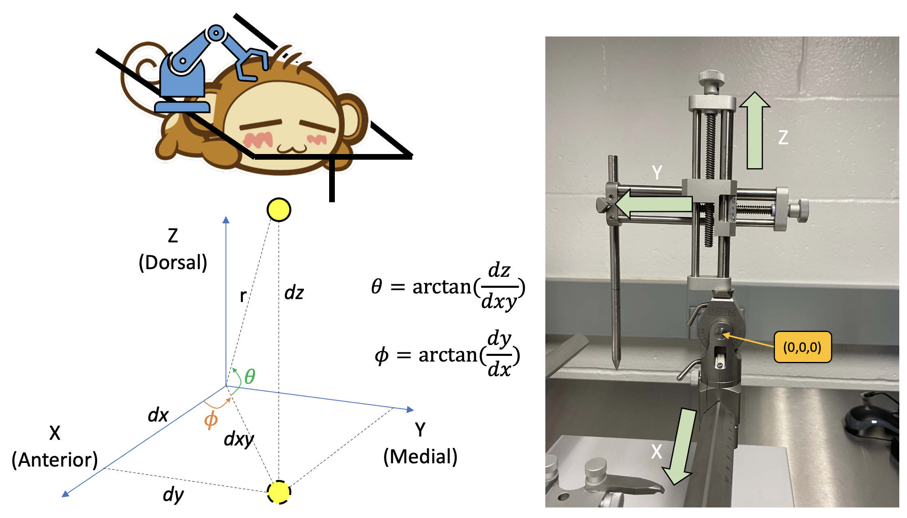

# Rotating Micromanipulator Arm

Author: Hung-Yun Lu, Cole R Barnett

> Rotating micromanipulator arm can be very tricky during an animal's surgery. When trying to move the arm to a desired point after rotation, moving along one axis will also cause displacement in other cartesian axes. Here, I present a way to calculate the displacement using the change of coordinate.

## Why do we need this?
If we want to move the micromanipulator arm at an desired angle and a specific position, we will need to rotate it to that angle, and manage to move it back to the original position. Although it's easy to calculate the angle, it's not as straightforward to move back to the original starting position since the axes are no longer orthogonal. We need a way to precisely and reliably calculate by how much we need to move in each direction so that we can reach the original point in rotated axes.

## How to use this?
1. Define the starting and ending point in the atlas. Use the `rotation_main()` function to output the angles and the distance. Point the needle tip to the starting point. Record the AP, ML, and DV values from the stereotax.
2. Instantiate `stereotax` using those coordinates as arguments.
3. Use the `rotate(theta,phi)` function to rotate.
4. Use the `moveback()` function to output how to reach the starting point from the new position.
5. Follow the print statements.

## Unreachable points
Due to the limitations of the micromanipulator arm, there are some points that is unable to reach. This can happen if the angles are too big. The unreachable points are also accounted for in the script in the `moveback()` function.

``` Python
## Example
S = stereotax(-16,20.4,39) # Starting point
S.rotate(5,10) # Rotate 5 and 10 degrees in polar and azimuthal angles.
S.moveback()

## Output
# Move x (AP) to 0.3860302773050037
# Move y (ML) to 29.347187670374133
# Move z (DV) to 33.18444426078773
```

## Understanding the stereotax
In our lab, we use the stereotax from Stoelting (ITEM 51804 and 51806). We define the cartesian axes as follows.

- x axis corresponds to the AP direction
- y axis corresponds to the ML direction
- z axis corresponds to the DV direction

In order to define meaningful directionality that matches the anatomical definition, positive x points to the anterior of the animal and positive z points dorsally. Positive y is more tricky. From the manipulator arm perspective, positive is toward the medial of the animal, but it's toward the lateral from the animal's perspective. The situation changes if the manipulator arm crosses the sagital line. However, that kind of situation is rare (reaching a point from the distant hemisphere). Therefore, for normal situations, the manipulator arm direction is opposite from the atlas direction. The calculation is based on the manipulator arm perspective - **positive y points to the medial**. We just need to address this issue while calculating the angle prior to rotation (see the `rotation_main` function). For example, if moving from (20,15,30) to (20,23,25), the change in y should be regarded as -8 for the micromanipulator arm.

There are two rotational angles from this stereotax, which are the azimuthal angle (phi) and the polar angle (theta). These angles are shown in the demonstration figure.



## Coordinate transformation
Any point described in the cartesian coordinate `(x,y,z)` can be transformed into a spherical coordinate `(r,theta,phi)`.

``` Python
import numpy as np
def cartesian_spherical(x,y,z):
    '''
    Tranform from cartesian to spherical coordinates.
    theta and phi are in radians
    '''
    r   = np.sqrt( x**2 + y**2 + z**2 )
    dxy = np.sqrt( x**2 + y**2 )
    theta = np.arctan2(z,dxy)
    phi   = np.arctan2(y,x)
    return r,theta,phi
```

Also, transferring between radians and degrees are easy.

``` Python
toDegree = lambda rad: rad * 180 / np.pi
toRadian = lambda ang: ang * np.pi / 180
```

## Defining zero in the rotation perspective
During rotation, it's easier to consider the pivot point as (0,0,0), as that is identical in both coordinates. The pivot point of the micromanipulator arm is at the center of the polar rotation joint. It could be confusing whether there are actually two distinct pivot points in the system since the rotation center of azimuthal and polar angles are not the same. The polar rotation joint IS the pivot point because when rotating azimuthally, the polar joint also rotates. It's not the other way round.

## Finding the cartesian coordinate of the point
To know the cartesian coordinate of a point to the polar joint, we first need to know the specifications of the stereotax, which is ironically the hardest part to achieve in the task. By measuring repeatedly (*this is the main source of errors), we can define the coordinates as follows.

1. **x coordinate**: This is the simplest as the arm cannot move laterally further from the pivot point, so this is fixed: 25.4 mm.
2. **y coordinate**: From the pivot point to the 0 mm of the scale is around 7.5 mm. There is another 36.3 mm away from the end of the scale that marks 80 mm. Therefore, the actual distance between our point and the pivot point is: *123.8-N*, where N is the number read on the scale.
3. **z coordinate**: This is the hardest to define as it depends on the length of the object held by the manipulator. The pivot point to the 0 mm of the scale is around 60 mm. We also need to measure the length of the held object from the tip (our point of interest) to the bottom of the micromanipulator adapter. The relationship is: N+60-L, where N is the number read on the scale in mm and L is the length of the object.

## Logic of rotation
1. We first transform the cartesian coordinate to spherical coordinate.
2. To rotate those angles, we just need to add the angles to the spherical coordinate to get the new coordinate. This method avoids very complex and prone-to-error rotation matrices that are dealt with in the cartesian coordinate.
3. Afterward, we transform back to the cartesian coordinate using the following function.

``` Python
def spherical_cartesian(r,theta,phi):
    '''
    Tranform from spherical to cartesian coordinates.
    theta and phi are in degrees
    '''
    theta = toRadian(theta)
    phi = toRadian(phi)

    x = r * np.cos(theta) * np.cos(phi)
    y = r * np.cos(theta) * np.sin(phi)
    z = r * np.sin(theta)

    return x,y,z
```

4. **VERY IMPORTANT!** Calculate the change of coordinate. Since the axes are no longer in the original places, thus we cannot move along the original xyz axes. The easiest way is to change the basis of the cartesian system, and then find the coordinates of the starting position and the current position expressed in the new system. The math is denoted in the document *Mathematical basics of stereotax rotation*. The implementation of this step is to rotate the y and z unit vector ((0,1,0) and (0,0,1)) using the same method to get y' and z'. Then use the original x unit vector and the new y'z' unit vectors to form a new basis.
5. Moving back to the original point. Because of the design of the arm, the moving logics are not the same.
- For x and z' axis, if the function indicates moving positively, we can move the direction that points to the positive.
- For y' axis, we need to do it in opposite direction. The scale is designed so that the further away from the pivot point, the smaller the number is. That means moving +10 mm in y' direction means moving the number from N to N-10.
